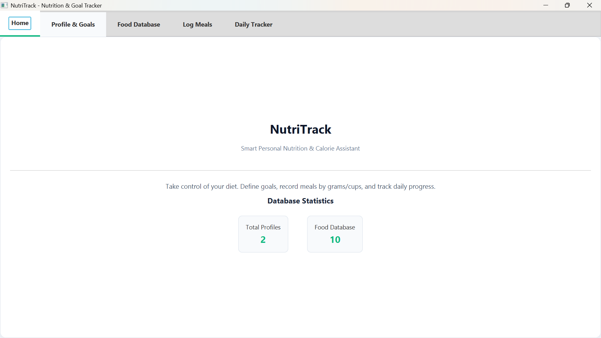
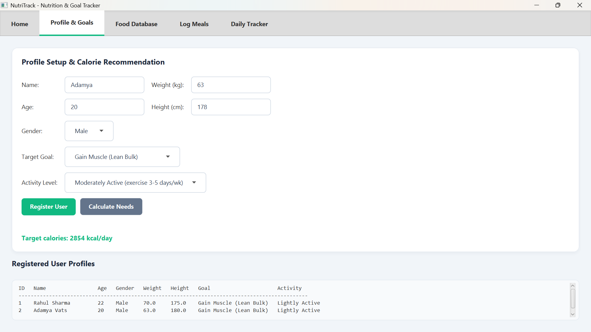
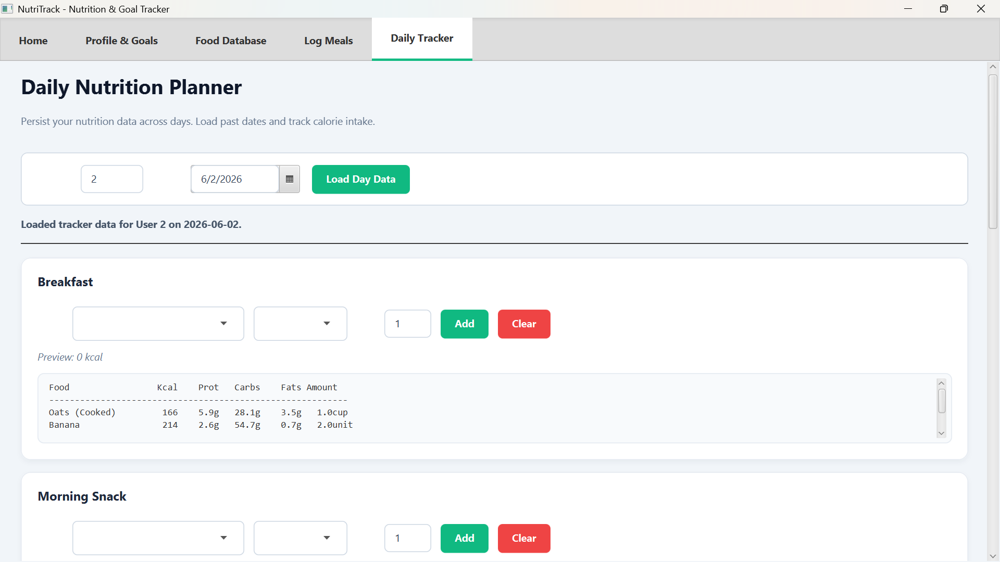
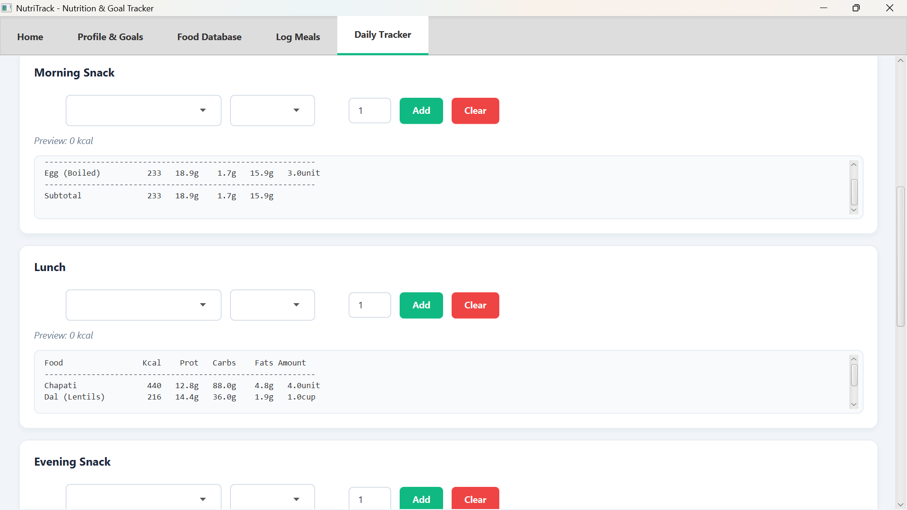
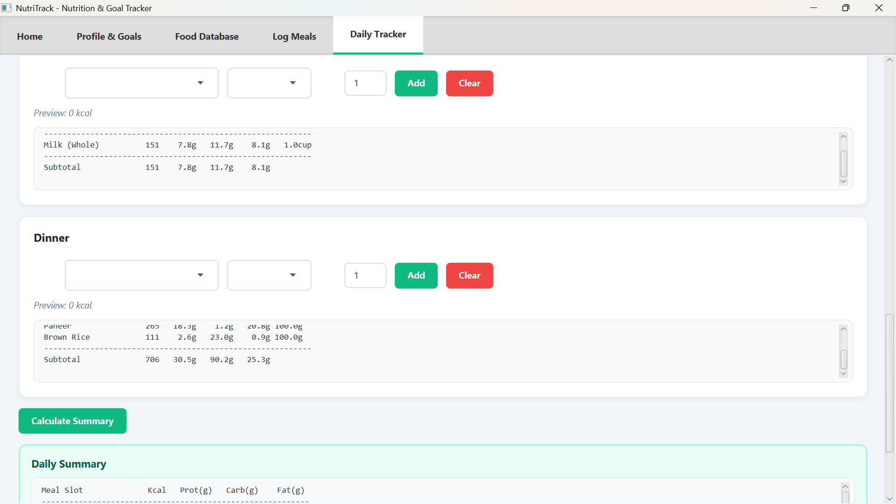
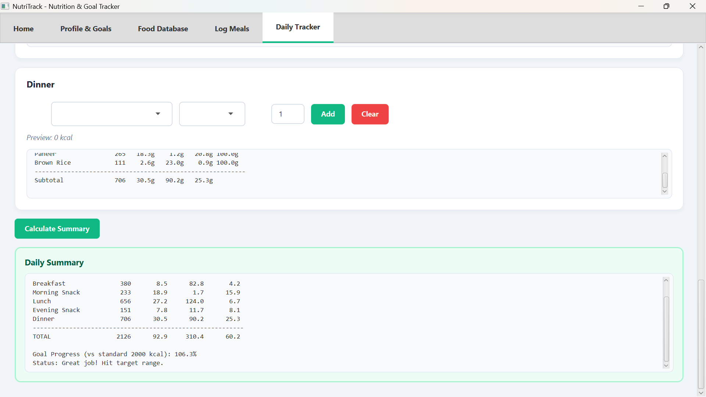

# NutriTrack

A modern Java application that tracks users, food items, and daily meals using MySQL. It features a console demo and a fully styled JavaFX dashboard.

---

## Key Features

- **Portion Conversions**: Add food items and track consumption in **Grams (g)**, **Cups**, or **Pieces/Units**. The system automatically handles portion-to-weight conversions using calibrated serving weights.

- **Date-Based Persistence**: Track and store meals across multiple/previous days. The Daily Tracker loads and persists slot records (Breakfast, Lunch, etc.) directly in the database by date.

- **Humanized Goals**: Calorie needs are calculated using the Mifflin-St Jeor formula scaled by **Activity Levels** (Sedentary to Very Active) and adjusted for **Realistic Goals** (Healthy Deficit, Aggressive Deficit, Lean Bulk, Active Surplus, Maintenance).

- **Premium GUI**: A polished JavaFX dashboard styled using an external modern CSS sheet (`style.css`) featuring a custom emerald theme, cards with subtle drop-shadows, dynamic focus states, and a **Live Nutrition Preview** as you type portions.

---

## Application Preview

### 🎥 Demo Walkthrough
Watch a video walkthrough of the app's functionality:

<video src="images/demo_walkthrough.mp4" controls width="100%"></video>

### 📸 Screenshots

| 🏠 Home Dashboard | 👤 Profile & Goals |
|---|---|
|  |  |

| 🍳 Daily Tracker (Breakfast) | 🥪 Daily Tracker (Lunch) |
|---|---|
|  |  |

| 🍲 Daily Tracker (Dinner) | 📊 Daily Summary & Progress |
|---|---|
|  |  |

---

## Project Structure

    nutritrack/
    ├── src/
    │   ├── model/          User, FoodItem, Meal (plain data classes & nested items)
    │   ├── dao/            UserDAO, FoodItemDAO, MealDAO (database queries)
    │   ├── util/           DatabaseUtil (connection helper), CalorieCalculator
    │   ├── view/           Dashboard (styled JavaFX GUI), style.css (theme sheet)
    │   └── Main.java       console demo entry point
    ├── sql/
    │   └── schema.sql      creates tables and seeds default food items
    ├── lib/                MySQL Connector/J and JavaFX SDK JARs
    ├── images/             Screenshots and demo video of the application
    └── README.md

---

## Prerequisites
- Java 17 or newer (tested on Java 25)
- MySQL 9.7 (or compatible) running on port 3307 with an empty root password
- MySQL Connector/J JAR in the `lib/` folder
- JavaFX SDK in the `lib/` folder (for the GUI)

---

## Setup & Run

### 1. Database Setup
Ensure MySQL is running on port 3307 and run the schema initialization script:
```powershell
Get-Content sql/schema.sql -Raw | mysql -u root --port=3307
```

### 2. Compilation
Compile the project (excluding the deleted controller package):
```powershell
javac --module-path "lib\javafx-sdk-23.0.2\lib" --add-modules javafx.controls -cp "src;lib\mysql-connector-j-8.4.0.jar" src\Main.java src\model\*.java src\view\*.java src\dao\*.java src\util\*.java
```

### 3. Run Console Demo
Run the console application to test database inserts, calculation logic, and macro scaling:
```powershell
java -cp "src;lib\mysql-connector-j-8.4.0.jar" Main
```

### 4. Run GUI Dashboard
Launch the styled JavaFX dashboard on your screen:
```powershell
java --module-path "lib\javafx-sdk-23.0.2\lib" --add-modules javafx.controls -cp "src;lib\mysql-connector-j-8.4.0.jar" view.Dashboard
```

---

## License
MIT License - feel free to use, modify, and share.
